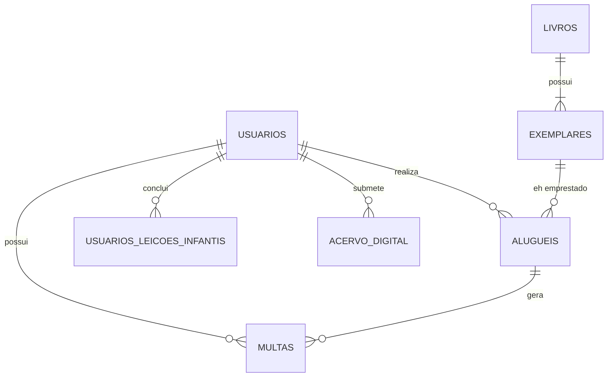

# 🏗️ Documentação Técnica: Ecossistema Biblio Verso

Esta documentação detalha a engenharia do sistema, focando no **Modelo Entidade-Relacionamento (ER)** e na arquitetura **Smart Backend**.

---

## 1. Arquitetura Smart Backend (Dumb Frontend)
O projeto rompe com a lógica de "sites" tradicionais. Ele opera como uma **Engine de Dados**:
- **Backend (O Cérebro)**: Toda validação de autenticação, cálculo de multas e progressão de RPG ocorre no servidor. Jamais confiamos no navegador (Thin Client).
- **Frontend (A Interface)**: Uma camada puramente visual (Vanilla JS, GSAP e Three.js) que apenas traduz os estados JSON recebidos da API em elementos visuais dinâmicos.

---

## 2. Modelo de Banco de Dados (Entidade-Relacionamento)
O Banco de Dados Relacional (MySQL/SQLite via Knex.js) é o ponto mais robusto do projeto. Ele garante a **Integridade Referencial** através de chaves estrangeiras complexas.

### 📊 Diagrama de Tabelas (ER)

### 📋 Detalhamento das Tabelas

#### `usuarios` (Identidades e Gamificação)
- **Campos Críticos**: `tipo` (Enum: usuario/bibliotecario), `infantil_xp`, `infantil_hearts`, `bloqueado`, `deleted_at`.
- **Estratégia**: Implementa **Soft Delete**. Ao "deletar" um usuário, seus registros permanecem no banco para integridade histórica de empréstimos, mas ele perde acesso à autenticação.

#### `livros` (Catálogo Maestro)
- **Função**: Metadados da obra (Título, Autor, Ano, Gênero).
- **Campo `exemplares_disponiveis`**: Reflete a contagem em tempo real de cópias prontas para empréstimo.

#### `exemplares` (Inventário Físico)
- **Relação**: Cada `livro_id` pode ter **N** exemplares.
- **Diferencial**: O exemplar tem um campo `disponibilidade` (Enum: disponivel, emprestado, indisponivel, perdido) e `condicao`. Isso permite que a biblioteca tenha 10 livros de "Harry Potter", mas retire apenas um para manutenção sem afetar os outros 9.

#### `alugueis` (Transação de Empréstimo)
- **Conecta 3 entidades**: `usuario_id`, `livro_id` e `exemplar_id`.
- **Campos**: `data_aluguel`, `data_prevista_devolucao`, `renovacoes`.

#### `multas` (Mecanismo Financeiro)
- **Geração Automática**: Vinculada obrigatoriamente a um `aluguel_id`.
- **Tipos**: `atraso` ou `perda`. Se um bibliotecário marcar um livro como "Perdido" no ato da devolução, o sistema gera o débito instantaneamente no perfil do usuário.

---

## 3. Fluxos de Inteligência (Business Logic)

### 🎮 Motor de Gamificação (Quiz)
Diferente de quizes comuns onde a resposta correta está no HTML/JS do frontend, o **Biblio Verso** implementa validação servidora:
1.  O Frontend envia a opção selecionável via POST.
2.  O **Backend** busca a resposta certa no seu `controller` privado.
3.  O Backend subtrai vida (`hearts`) ou soma `XP` no SQL.
4.  O Backend responde se está correto e qual o novo estado do usuário.
**Vantagem**: Reduz a 0% a chance de trapaças via console.

### 💰 Gestão de Bloqueio e Restrição
O middleware de empréstimo realiza três verificações antes de permitir o `aluguel`:
1.  **Usuário Bloqueado?** (Status no banco).
2.  **Multas Pendentes?** (Soma rápida na tabela de multas).
3.  **Limite de Livros Alcançado?** (Count na tabela de aluguéis ativos).

---

## 4. Segurança e Infraestrutura
- **Bcrypt.js**: Criptografia saltada de senhas. Nem o administrador do banco consegue ver a senha real dos usuários.
- **JWT (JSON Web Tokens)**: Autenticação Stateless. O servidor não guarda sessão (RAM), apenas valida o token assinado matematicamente em cada requisição.
- **Knex.js**: Previne **SQL Injection** de forma nativa ao higienizar todas as entradas dinâmicas (Query Builder).
- **Indices Estratégicos**: Chaves estrangeiras com `INDEX` em campos como `tipo`, `status` e `deleted_at` para buscas ultra-rápidas, mesmo com milhares de registros.

---
