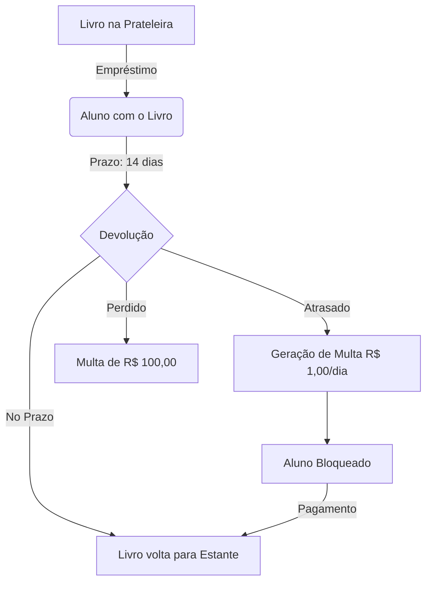

# 🎤 Guia de Apresentação: LuizaTeca

Este documento foi criado para ajudar quem não entende de programação a explicar o projeto em slides. Ele traduz os conceitos técnicos para uma linguagem simples e visual.

---

## 🏗️ 1. O que é o LuizaTeca? (Slide de Introdução)
*   **Conceito**: Uma biblioteca moderna que une o mundo físico e o digital em um único lugar.
*   **Missão**: Facilitar o empréstimo de livros físicos e o compartilhamento de conhecimento através de acervo digital (PDFs).
*   **O Diferencial**: Um design "Premium" que foca na beleza e na facilidade de uso (UX/UI).

---

## 🛠️ 2. Como o Sistema Funciona? (Slide de Arquitetura)
Explique o projeto como se fosse um corpo humano:
*   **O Cérebro (Backend)**: É onde todas as regras e cálculos acontecem. Ele decide quem pode pegar livro, calcula as multas e guarda as informações com segurança.
*   **O Rosto (Frontend Web)**: É a parte bonita que o usuário vê. É colorida, moderna e funciona em qualquer navegador.
*   **A Ferramenta (CLI)**: Uma versão simplificada "em texto" para que o bibliotecário possa fazer tarefas rápidas pelo teclado.
*   **A Regra de Ouro**: O "Frontend Burro". Isso significa que as telas não "pensam", elas apenas mostram o que o "Cérebro" (Backend) manda. Isso evita erros de cálculo.

---

## 📚 3. O Fluxo de Livros (Slide de Operação)
Use este diagrama para explicar o dia a dia da biblioteca:

---

## 💎 4. Funcionalidades de Destaque (Slide de Recursos)
*   **Acervo Digital (Hybrid Hub)**: Alunos podem enviar PDFs que são revisados e aprovados pelo bibliotecário antes de aparecerem para todos.
*   **Soft Delete (Segurança de Dados)**: Nada é "apagado" de verdade. Se um livro é removido, ele é apenas "arquivado". Isso garante que o histórico de quem pegou o livro nunca se perca.
*   **Centro de Notificações**: Um lugar único onde o aluno vê se tem multas ou livros vencendo, e o bibliotecário vê o que precisa aprovar.
*   **Estética Premium**: Uso de cores vibrantes, modo escuro (Dark Mode) e efeitos de vidro (Glassmorphism).

---

## ⚡ 5. Sincronia Universal: Web ↔ CLI (Slide de Estratégia)
Um dos maiores pontos fortes do LuizaTeca é a comunicação transparente entre os usuários:
*   **Um Só Cérebro, Dois Rostos**: Embora o site (`Web`) e o terminal (`CLI`) pareçam diferentes, eles estão conectados ao **mesmo Backend**.
*   **Tempo Real**: Se um Bibliotecário aprova um livro pelo terminal (CLI), ele aparece **na hora** para o aluno no site (Web). 
*   **Consistência de Dados**: O sistema garante que a regra seja a mesma para todos. Se um aluno é bloqueado no Web por uma multa, ele também não conseguirá usar o CLI.
*   **Colaboração Híbrida**: O bibliotecário pode gerenciar o estoque pela agilidade do terminal enquanto o aluno desfruta da beleza visual do site, sem nunca haver conflito de informações.

---

## 📊 6. Regras de Ouro do Projeto (Slide de Conclusão)
1.  **Segurança Total**: Usuários com dívidas ou bloqueados não conseguem retirar novos livros.
2.  **Transparência**: O sistema diz exatamente o corredor e a prateleira onde o livro físico está.
3.  **Hibridismo**: O aluno escolhe se quer ir à biblioteca buscar o físico ou ler o digital na hora.

---

### 💡 Dicas para a Apresentação:
-   **Foque no Design**: Mostre prints da tela do Acervo Digital e das Notificações.
-   **Enfatize a Inteligência**: Diga que o sistema "se autocorrige" (os cálculos são automáticos no servidor).
-   **Mencione a Auditoria**: Diga que o código passou por uma análise profunda para garantir que nenhum dado seja perdido.
